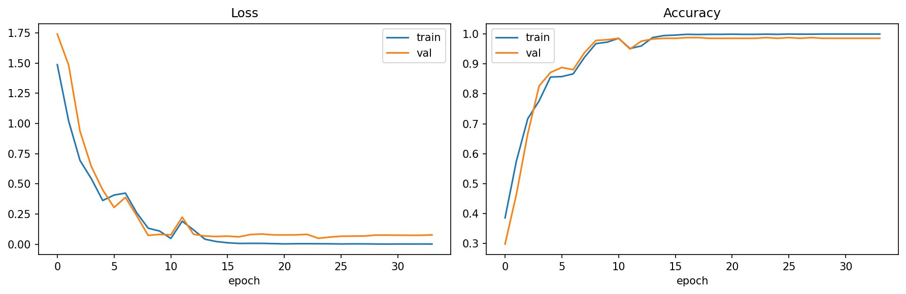
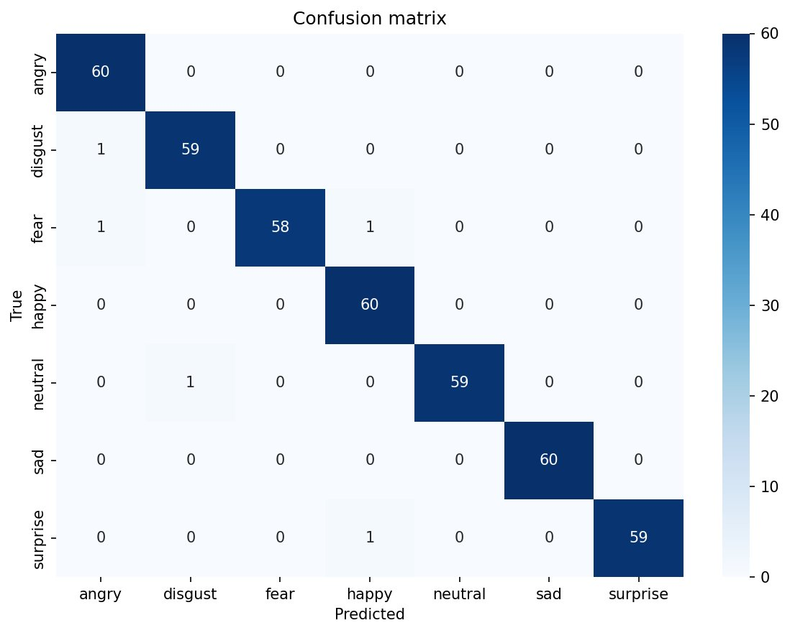

# Speech Emotion Recognition with LSTM (TESS)

A deep learning pipeline that classifies emotional content in speech audio across seven emotion categories. Built with TensorFlow/Keras on the Toronto Emotional Speech Set, using MFCC sequence features and a recurrent classifier.

---

## Results

| Metric | Value |
| --- | --- |
| **Test accuracy** | **98.81%** (415 / 420) |
| Test set size | 420 samples (60 per class, stratified) |
| Trainable parameters | 346,759 |
| Convergence | ~13 epochs (early-stopped, restored to best weights) |

Per-class performance on the held-out test set:

| Emotion | Precision | Recall | F1 | Support |
| --- | --- | --- | --- | --- |
| angry | 0.97 | 1.00 | 0.98 | 60 |
| disgust | 0.98 | 0.98 | 0.98 | 60 |
| fear | 1.00 | 0.97 | 0.98 | 60 |
| happy | 0.97 | 1.00 | 0.98 | 60 |
| neutral | 1.00 | 0.98 | 0.99 | 60 |
| sad | 1.00 | 1.00 | 1.00 | 60 |
| surprise | 1.00 | 0.98 | 0.99 | 60 |
| **macro avg** | **0.99** | **0.99** | **0.99** | **420** |

The five misclassifications are all between phonetically or prosodically similar classes (e.g. fear → happy, surprise → happy), which is the standard error pattern for prosodic emotion classifiers.




---

## Demo

```bash
$ python inference.py samples/example.wav

File:      samples/example.wav
Predicted: neutral  (confidence 99.90%)

All class probabilities:
  neutral      0.999  █████████████████████████████
  sad          0.001
  fear         0.000
  ...
```

---

## Dataset

**Toronto Emotional Speech Set (TESS)**
- Source: [Kaggle](https://www.kaggle.com/datasets/ejlok1/toronto-emotional-speech-set-tess) · [University of Toronto archive](https://tspace.library.utoronto.ca/handle/1807/24487)
- 2,800 audio files · 16-bit mono WAV · ~2 s per clip
- 2 actresses (one young, one older), each speaking 200 target words inside the carrier phrase *"Say the word ____"*
- 7 emotions: angry, disgust, fear, happy, neutral, pleasant surprise, sad

> **Note on the Kaggle mirror:** the public Kaggle copy stores the data under two folders with different casing (`TESS …` and `tess …`), giving 5,600 files of which exactly half are duplicates. The notebook deduplicates by filename before splitting so the test set does not leak into training. Several public TESS notebooks miss this and report inflated metrics — disabling the dedupe step gives a reproducible 99.6%+ "test accuracy" that is partly leakage.

---

## Approach

### Audio preprocessing

1. Load each WAV at 22,050 Hz
2. Pad or trim to a fixed 3-second window
3. Extract 40 MFCC coefficients per frame (~130 frames per clip)
4. Standardize using **train-set** mean and standard deviation (no test-set leakage)

Most published TESS notebooks average MFCCs across time, collapsing the temporal dimension before feeding the model. This implementation keeps the time axis so the LSTM operates on a true sequence.

### Model architecture

```
Input  (130 frames × 40 MFCCs)
     ↓
LSTM (256 units)
     ↓
BatchNorm + Dropout(0.3)
     ↓
Dense (128, ReLU) + Dropout(0.3)
     ↓
Dense (64, ReLU) + Dropout(0.2)
     ↓
Dense (7, softmax)
```

| Hyperparameter | Value |
| --- | --- |
| Optimizer | Adam, lr = 1e-3 |
| Loss | categorical cross-entropy |
| Batch size | 32 |
| Max epochs | 60 (early-stopped on val_loss, patience 10) |
| LR schedule | ReduceLROnPlateau, factor 0.5, patience 4 |

### Data split

Stratified 70 / 15 / 15 train / validation / test, with `random_state=42` fixed for reproducibility. Standardization statistics are computed on the training set only.

---

## Reproducibility

The full pipeline runs end-to-end on Kaggle's free GPU tier in about five minutes.

1. Open `notebook.ipynb` on Kaggle (File → Import Notebook).
2. **Add Input** → Datasets tab → search *toronto emotional speech set* → add `ejlok1/toronto-emotional-speech-set-tess`.
3. **Settings** → Accelerator: GPU T4 ×2.
4. **Run All**.

Saved artifacts (`emotion_lstm.keras`, `preprocess.npz`, plot PNGs) appear in `/kaggle/working/`.

---

## Repository structure

```
.
├── README.md
├── notebook.ipynb              # full pipeline (Kaggle-ready)
├── inference.py                # standalone WAV → emotion predictor
├── requirements.txt
├── LICENSE
├── .gitignore
├── models/
│   ├── emotion_lstm.keras      # trained model weights
│   └── preprocess.npz          # mean / std / class labels for inference
└── results/
    ├── training_curves.png
    └── confusion_matrix.png
```

---

## Local inference

```bash
git clone https://github.com/<your-username>/speech-emotion-recognition.git
cd speech-emotion-recognition
pip install -r requirements.txt
python inference.py path/to/your_audio.wav
```

Audio is automatically resampled to 22,050 Hz and padded/trimmed to 3 seconds; any reasonable mono WAV will work.

---

## Caveats and limitations

- **TESS is a controlled, low-difficulty benchmark.** Two speakers, lab-quality recordings, and 200 scripted carrier-phrase utterances make it much easier than spontaneous in-the-wild speech. The accuracy on TESS is **not** a fair predictor of performance on noisy real-world audio, multi-speaker conversation, or spontaneous emotional expression.
- **Generalization to other accents, age groups, and languages is untested** — TESS contains only North American English from two female speakers.
- A non-trivial portion of recent SER papers report ~99% on TESS; the field has largely moved to harder benchmarks (RAVDESS, CREMA-D, IEMOCAP, MELD) for meaningful comparisons.

---

## Future work

- Streamlit web app with browser-based microphone input for live demos
- Cross-corpus evaluation on RAVDESS / CREMA-D to test out-of-distribution generalization
- CNN-on-mel-spectrogram and CRNN baselines for comparison
- TensorFlow Lite export for lightweight on-device inference

---

## Tech stack

Python 3.10 · TensorFlow 2.19 · Keras · librosa 0.11 · scikit-learn · NumPy · pandas · matplotlib · seaborn

---

## References

Pichora-Fuller, M. K., & Dupuis, K. (2020). *Toronto emotional speech set (TESS).* Borealis Dataverse. https://doi.org/10.5683/SP2/E8H2MF

Hochreiter, S., & Schmidhuber, J. (1997). Long short-term memory. *Neural Computation, 9*(8), 1735–1780.

---

## License

MIT — see [LICENSE](LICENSE) for details.
